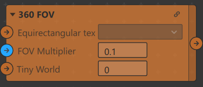
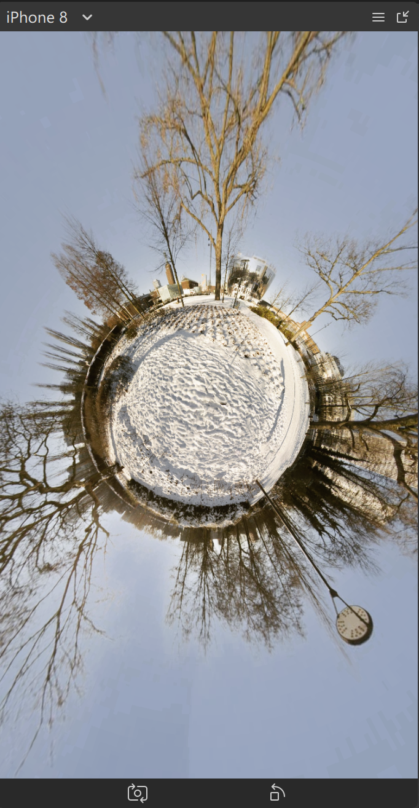

# equirectangular-FOV-spark-ar
Equirectangular FOV | Spark AR

##Change the Field of View of 360° Equirectangular Texture

You can make a Tiny World effect by changing the field (Value range between 0 and 1.5)

|  |

